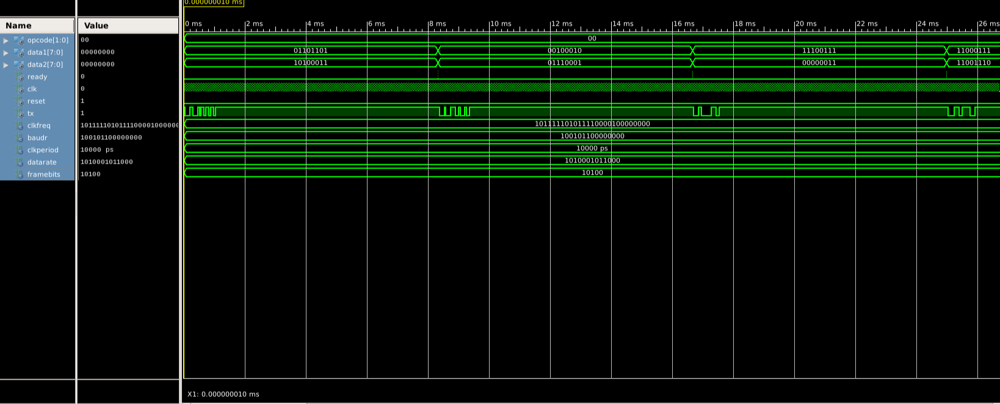
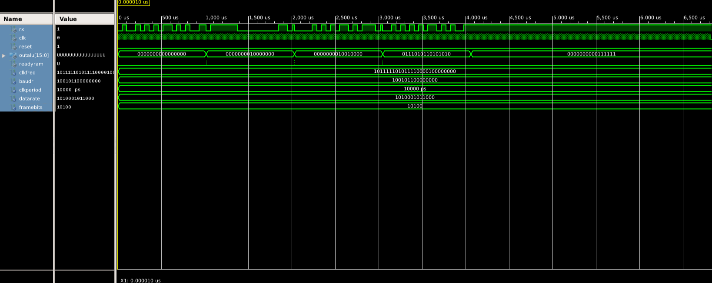
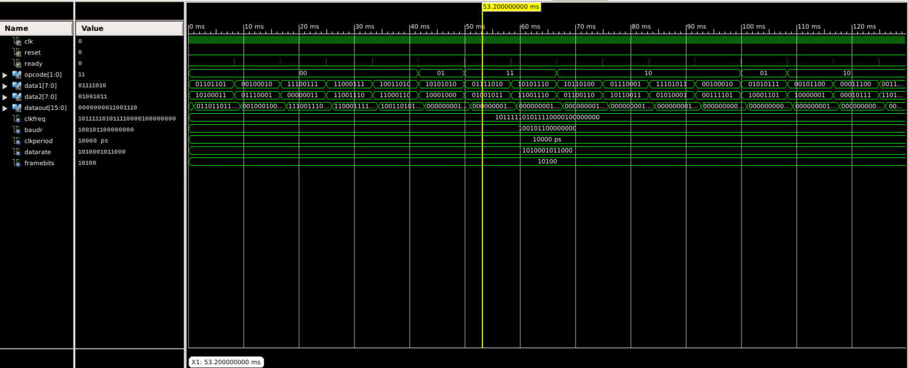

# Testbench Documentation

This document outlines the verification strategy used for the **UART-Integrated 16-bit ALU System**.  
All testbenches were simulated in **ISim (Xilinx ISE)**, using clock-driven processes, randomized inputs, and cycle-synchronized waits to validate both module-level and top-level functionality.

---

## General Test Strategy

- **Clock generation**: 100 MHz reference clock (10 ns period), defined in each TB.  
- **Reset handling**: Active-high reset applied for several cycles before stimulus.  
- **Stimulus**:  
  - Directed cases (fixed opcode/data values).  
  - Randomized data injection for broader coverage.  
- **Wait mechanisms**: Instead of fixed delays, clock-cycle counters matched to the computed baud rate (`clkFrequency / baudrate`) ensured correct synchronization.  
- **Checks**: Functional correctness observed through waveform traces and assertion logs.  

---

## Module-Level Tests

### 1. Transmitter
- **Objective**: Verify serialization of `{opcode, data1, data2}` with correct frame structure.  
- **Method**: Apply `ready = '1'` for one cycle with defined inputs, observe TX waveform.  
- **Expected frame**: Start bit (0) → opcode (2b, LSB first) → data1 (8b) → data2 (8b) → stop bit (1).  
- **Waveform**:  
  

---

### 2. Receiver + ALU
- **Objective**: Validate correct frame reception and ALU execution.  
- **Method**: Feed transmitter output into `rx`.  
- **FSM path**: `Idle → StartBit → Receiving → StopBit → Arithmetic → Idle`.  
- **Checks**:  
  - Sampling at half-bit intervals.  
  - ALU operations triggered by opcode (`00 = Concat`, `10 = AND`, `01 = XOR`, `11 = XNOR`).  
- **Waveform**:  
  

---

### 3. Write-Only RAM
- **Objective**: Confirm synchronous write of ALU results.  
- **Method**: Monitor `readyRam`. On assertion, write `outAlu` into RAM.  
- **Checks**:  
  - Writes only on positive edge when `readyRam = '1'`.  
  - Reset clears all memory cells.  
- **Waveform**:  
  

---

### 4. Top Module
- **Objective**: Validate full integration: Transmitter → Receiver/ALU → RAM.  
- **Method**: Apply multiple `(opcode, data1, data2)` triplets.  
- **Checks**:  
  - Correct opcode operation.  
  - Latency = transmit duration + receive/ALU delay + one RAM write cycle.  
- **Waveform**:  
  

---

## Notes
- Simulation time extended to `dataRate * frameBits` to capture complete transactions.  
- Generics (`clkFrequency`, `baudrate`, `depth`) allowed parameterized testbenches.  
- Random vs directed stimuli ensured both coverage and correctness verification.  
- Testbenches emphasize **synchronization with baud timing** instead of relying on arbitrary delays.

---
